# Roblox 玩法套利研究报告

数据快照：2026-10-08（Roblox 榜单 15:01 UTC，竞品检索 15:16 UTC；网页平台当日抓取）。
所有数字都能用 `scripts/` 里的脚本重新生成，参数在 `data/model_params.json`。

术语：**CCU** = 同时在线人数。**起量** = 上线后头 12 个月平均 CCU ≥ 100（约 87.6 万游玩小时）。**数据关口** = 做完 MVP 并买量试投、拿到留存数据的那个决策点。

---

## 0. 结论

**现在优先做哪一款：「发射／冲距离 + 升级重试」类（Learn to Fly、Burrito Bison、Toss the Turtle 这一脉），做成 Roblox 的增量模拟器。**

但这个答案带两个必须一起读的限定：

1. **它只在"分阶段、亏损封顶的实验"这个形式下成立。** 按一次性做完再上线的方式，所有候选的风险调整价值都是负的。
2. **是否值得做取决于你一小时的真实机会成本。** 低于约 $16/小时：做。高于约 $28/小时：不做。中间：看你能不能接受"大概率白干 25 到 65 小时"。

| 首选方向的关键数字（基准情景） | 数值 |
|---|---|
| 起量概率 | 7.4%（90% 区间 1.6%–18.3%） |
| 到数据关口的投入 | 走完约 65 小时，外加试投现金 $100–500。期望值是 47 小时和 $164，因为约四成项目会在第 23 小时左右的第一道关口被砍掉 |
| 期望总工时 | 分阶段 74 小时；一次性做完 160 小时 |
| 期望收入 | $2,426；若起量，首年收入中位数 $9,292 |
| 每开发小时净值 | 均值 $28（5% / 50% / 95% 分位：$0 / $14 / $93） |
| 利润 > 0 的概率（时间按 $20/小时计） | 3.9% |
| 利润分布（同上口径） | 中位数 −$999；95 分位 −$195；99 分位 +$30,176 |
| 风险调整价值 V | 分阶段 −$435；一次性投入 −$3,124 |

直白地说：**最可能的结果是亏掉 25 到 65 小时的时间**，期望值为正全靠一条很长的右尾。这是一张期望值略为正的彩票，不是一份收入计划。

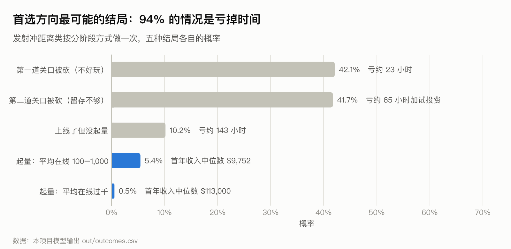

**为什么它排在其他候选前面**（详见第 7、8 节）：

- 模型里它和另外三个候选在统计上打平（"排第一"的概率最高的也只有 31%）。基准情景它排第 3，关掉最不可靠的那个代理变量后排第 1。
- 打平之后用四个可核实的指标决胜：到数据关口最便宜（期望 47 小时，并列最低）；Roblox 上的证据最干净（近 12 个月有 9 款同玩法新品累计访问超过 500 万）；单人可玩、无对战同步、无法被捣乱；代码框架能直接复用到第 4、7、8 名。

**四个比"选哪款"更重要的发现：**

1. **怎么下注比押哪个重要。** 分阶段比一次性做完，每个项目多出约 $2,700 的风险调整价值；而前四名之间的差距只有约 $1,000。
2. **网页热度几乎不能预测 Roblox 热度。** 47 个玩法的秩相关系数只有 0.27。真正有信息量的是 Roblox 自己的数据。
3. **"Roblox 上没有竞品"在数据里多半是坟场，不是空白。** 47 个网页原生玩法中，37 个在 Roblox 上已有活着的对应品类，只有 2 个真正没人认真试过，3 个是多人试过后死掉的。你最初"找未被满足的需求"的前提，大部分不成立。
4. **新游戏起步时碰不到儿童和青少年。** 2026 年 6 月起，新游戏先只对已验龄的 16 岁以上用户开放（约占日活的四分之一），拿到 250 次"高活跃用户"游玩后才进入 5–15 岁用户的目录。**本报告第一版漏掉了这一点**，它改变了验证方案，见第 9、10、12 节。

---

## 1. 数据说了什么

### 1.1 套利是真的，但它是双向的，而且已经很快

Roblox 上已经有人在做你想做的事，而且直接写在简介里：

| Roblox 体验 | 自述来源 | 创建 | 累计访问 | 当前 CCU | 好评率 |
|---|---|---|---|---|---|
| Endless GAMES | "一整个街机厅，经典小游戏随便切" | 2026-07 | 5,990 万 | 约 1,100 | 0.92 |
| Dash World | "inspired by geometry dash" | 2025-06 | 2.12 亿 | 约 1,400 | 0.63 |
| BEAT BOUNCE (GEOMETRY DASH) | 同上 | 2023-12 | 5.27 亿 | 约 1,930 | 0.72 |
| Subway Surfing | Subway Surfers | 2025-09 | 3,390 万 | 约 610 | 0.88 |
| 2D Basketball | "fan-made unofficial version of basket random" | 2024-06 | 2,990 万 | 39 | 0.76 |
| Rage Bait | "INSPIRED BY: Level Devil" | 2025-12 | 1,290 万 | 17 | 0.74 |
| Capture for Magic! | "Inspired by paper io" | 2026-05 | 780 万 | 约 430 | 0.62 |
| Stack the Shapes | "Inspired by Super Stacker 2" | 2026-06 | 240 万 | 约 1,210 | 未取 |

反方向同样在发生。我抓到的网页平台记录里有 100 款是 Roblox 爆款的克隆，占网页注意力的 1.06%：Poki 本周热门第 15 位是"Steal A Brainrot"，CrazyGames 的"Escape Tsunami for Brainrots!"有 1,300 万次游玩，TwoPlayerGames 首页挂着"+1 Speed Keyboard Lucky Escape"。

含义：两个平台之间的信息差是以周计的，不存在一个没人看见的金矿。

### 1.2 流量好拿，留人很难

很多移植作品都拿到过巨大的访问量，然后迅速衰减：

| Roblox 体验 | 对应网页玩法 | 累计访问 | 当前 CCU |
|---|---|---|---|
| Super Head Soccer | 大头足球 | 1.15 亿（7 个月） | 约 900 |
| Color Game! | paper.io | 2.00 亿 | 约 380 |
| Subway Surfers（2022 版） | Subway Surfers | 7,590 万 | 21 |
| Watermelon GO! | 合成大西瓜 | 7,530 万 | 185 |
| Stack Ball | Helix / Stack | 7,060 万 | 9 |
| Super Free Kick | 任意球 | 4,110 万 | 5 |
| Roblox Flappy Bird | Flappy Bird | 2,200 万 | 11 |

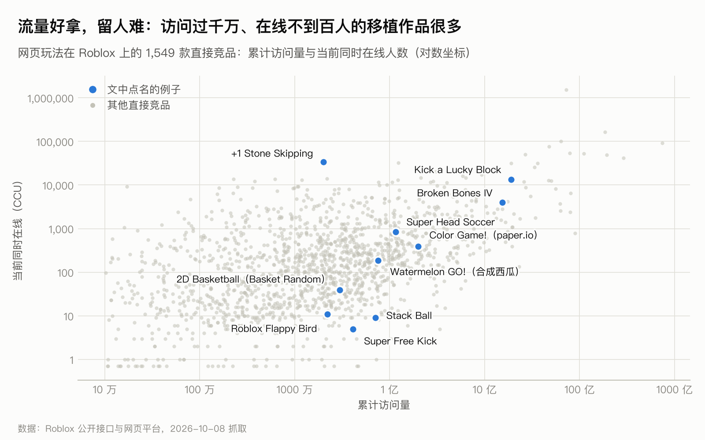

这有两面。好的一面：首年收入取决于累计游玩小时，不取决于今天的 CCU，一款"昙花一现"的游戏也可能已经赚到钱。坏的一面：生命周期短，而 Roblox 在 2026 年 4 月把推荐算法的留存窗口从 7 天拉长到 28 天，明确偏向长期留存。

### 1.3 市场流动性极高，新人进得去

- Roblox 官方"最赚钱"榜我抓到 472 款，其中 **227 款创建不到 12 个月**。
- 各榜单合计有 **157 款创建不到 90 天的游戏当前 CCU ≥ 1,000**，其中 44 款不到 30 天。
- "Up-and-Coming"榜 62 款：创建天数中位数 25 天，累计访问中位数 246 万。
- 我核查了 25 款头部新品的发行方：17 个发行组名下没有其他公开游戏，只有 5 个另有一款访问超过 100 万的作品。（保留意见：发行商可以为每款游戏新建一个组，所以这不能证明它们是个人开发者。）

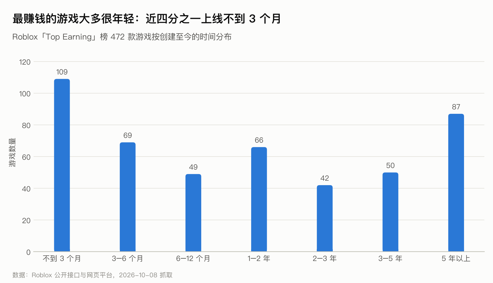

第三方统计（RoWatcher，2026 年 6 月）给出的全平台结构：任一时刻约 1.9 万款游戏有人在玩，约 1,370 款 CCU ≥ 1,000，112 款 ≥ 10,000，12 款 ≥ 100,000。

### 1.4 钱在增量模拟器和大亨里

472 款最赚钱的游戏按 Roblox 自己的类型标签分：大亨 75 款、增量模拟器 72 款（两者合计 31%），动作 68，RPG 46，生存 43，派对休闲 9，跑酷平台只有 4。创建不到 12 个月的 227 款里，大亨 58、增量模拟器 55。

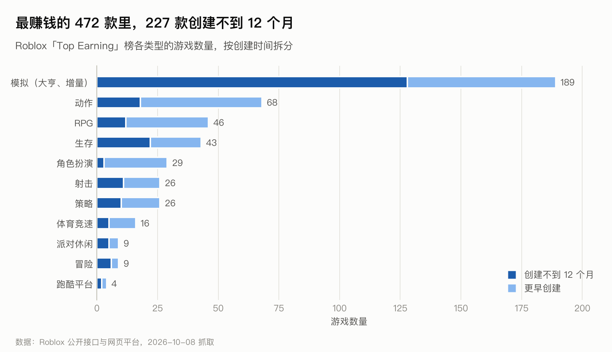

你喜欢的"短局、搞笑物理、轻竞技"这类体验，在 Roblox 上通常要套一层"升级、重生、收集"的外壳才变现。

### 1.5 网页热度的迁移性很弱

47 个网页原生玩法，网页注意力份额与 Roblox 直接竞品 CCU 的秩相关只有 **0.27**。例子：三车道跑酷占网页注意力 5.5%，但 Roblox 上真正的同类克隆最高只有约 600 CCU；发射类只占 1.26%，在 Roblox 上却有 5.1 万 CCU。

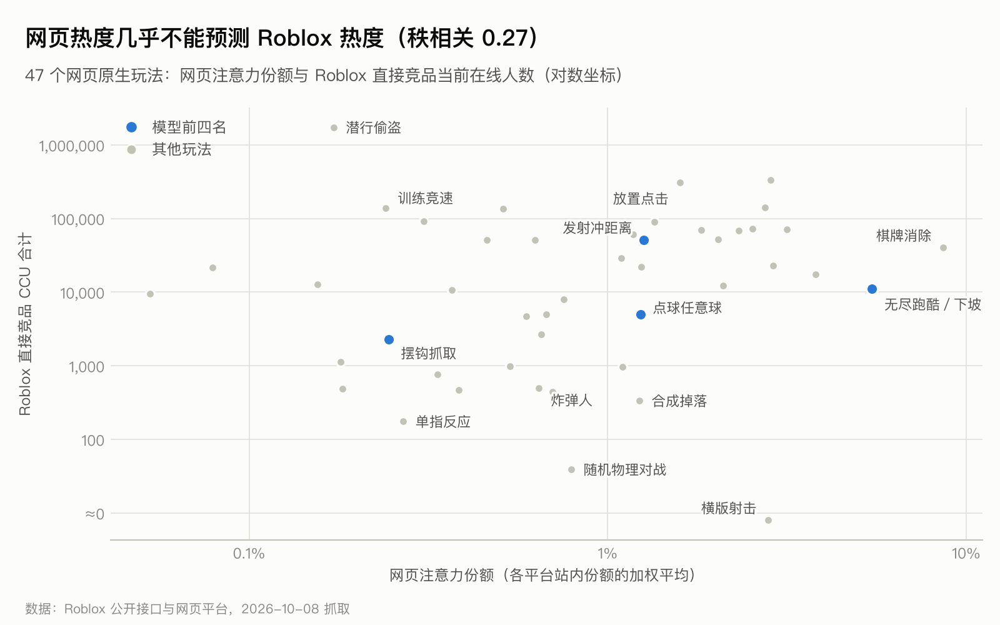

所以模型里网页证据的权重被刻意压得很低，Roblox 自身证据的权重更高。

---

## 2. 方法（交付 A）

研究单位不是"游戏"，而是**玩法原型**：能被合法借鉴的是核心循环，不是标题、角色或美术。3,787 个去重后的游戏系列被归入 49 个原型。

| 阶段 | 做了什么 | 产出 |
|---|---|---|
| 1 数据真实性 | 只记录平台自己公布的数字；抓不到的平台不填补 | `data/web_games_raw.csv` |
| 2 基本适配 | 可观察的通过／不通过筛选，不打分 | `data/archetypes.json` 里的 `screens` |
| 3 跨平台需求 | 站内份额标准化，分"历史"和"当前"两个视角 | `data/games.csv`、`archetype_demand.csv` |
| 4 Roblox 竞争 | 232 个检索词，人工校正的直接竞品名单 | `roblox_competitors.csv`、`archetype_competition.csv` |
| 5 成本 | 三点估计工时 × 超支分布；现金单列 | `archetypes.json` 的 `mvp_h` 等 |
| 6 商业潜力 | 游玩小时 × 每小时分成 × 折扣 | `model_params.json` |
| 7 风险调整排序 | 贝叶斯赔率更新 + 两层蒙特卡洛 | `out/ranking.csv` |
| 8 最小成本实验 | 两道关口的分阶段策略，计算分阶段的价值 | 本报告第 9、10 节 |

### Q1 如何衡量原版需求、如何跨站比较

**不跨站比较原始数字。** 在每个站内把游戏换算成它占该站"被测量到的注意力"的份额：有游玩次数或投票数的用实际占比；只有名次的（4399、7k7k、Poki 热门榜）按 1/名次 分配。份额没有单位，可以跨站平均。

- "4399 月榜第 10"和"CrazyGames 100 万次游玩"因此各自变成"占本站榜单注意力的百分之几"。
- 缺失值不填补。某游戏不在某站榜单上，就是该站份额为 0，这本身是信息；抓不到的站直接不进入平均。
- 同时算两个视角：历史累计（总游玩、总榜）和当前（本周热门、月榜）。两者之比是"动量"，用来识别"历史上火过但现在没人玩"的玩法。
- **品牌依赖度**：一个原型里最大的那个系列占该原型注意力的比例。超过 60% 说明需求是冲着那个品牌来的，换皮后未必还在。
- 额外探针：Scratch 上儿童自制克隆的浏览量。Scratch 用户和 Roblox 用户年龄段最接近，但带品牌名的查询会把品牌热度一起算进来，只作参考。

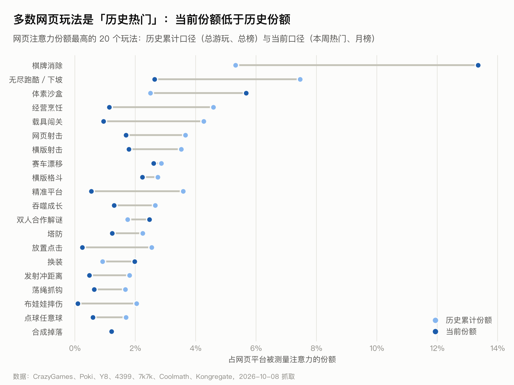

### Q2 如何量化 Roblox 竞争、如何区分"空白"与"没需求"

每个原型用若干检索词查 Roblox 搜索接口（每词取 80 条），再用游戏详情接口补全访问量、创建和更新日期。名称匹配之后，我逐个读了头部结果的简介来校正（例如"Ball VS Ball"是自走棋，不是物理对战；"Tank Wars!"是大亨）。

区分"空白"和"没需求"靠的是**尝试者的下场**，分六种情况：

| 证据桶 | 判定规则（全部来自实测数据） | 含义 | 原型数 |
|---|---|---|---|
| proven_open | 直接竞品 CCU ≥ 5,000，且近 12 个月至少 3 款新品访问 ≥ 500 万 | 需求已证实，新人正在进入 | 29 |
| live_open | CCU ≥ 500，且至少 1 款这样的新品 | 有需求，有人进得去 | 8 |
| live_entrenched | CCU ≥ 1,000，但一年内没有新品起量 | 有需求，被老游戏占着 | 2 |
| thin | CCU 100–1,000 | 需求很薄 | 3 |
| tried_and_died | 至少 2 款拿过 100 万访问、现在不到 20 人在线 | 试过，留不住人 | 3 |
| untested | 认真尝试过的不到 2 款 | 真正的未知 | 2 |

"认真尝试"指累计访问过 1 万。**只有 untested 才算空白，而且空白只意味着"未知"，不意味着"机会"。**

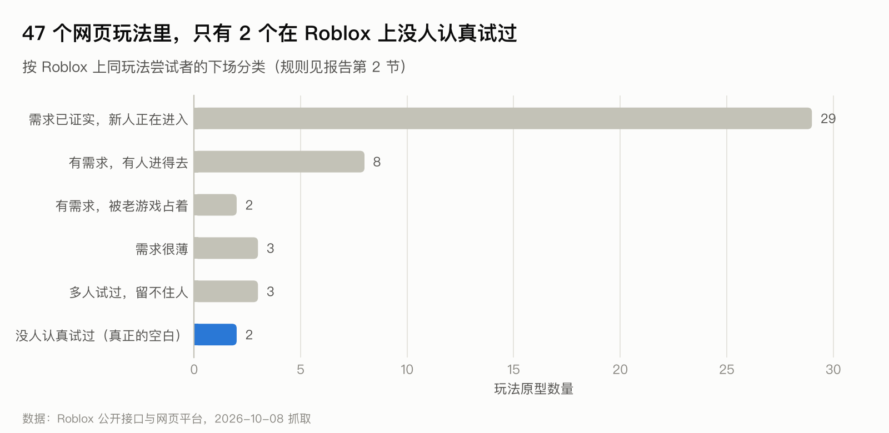

### Q3 如何衡量可玩性

没有让模型给"好玩程度"打分。阶段 2 只用可观察的通过／不通过项：规则 5 秒内无文字可懂；拿到控制权后 10 秒内出现有趣事件；一局短且可瞬间重开；能否被单个恶意玩家破坏；一两根拇指能否操作；一个人在线时是否还好玩。这些是我根据玩法结构做的判断，不是测量。

真正的测量放在实验里（第 9 节）：首次操作用时、无奖励情况下的自愿重复次数、每用户局数、会话时长。"去掉金币和等级后还玩不玩"就是关口 A 的测试内容。

### Q4 如何预测留存

**没有任何一款游戏的真实留存数据，所以没有生成留存率。** 公开的"Roblox 留存基准"我找到的都是第三方文章，彼此矛盾（跑酷类的"良好 D1"一处说 20%，另一处说 25%–35%），且没有样本说明。Roblox 官方文档不给数值。

替代做法：用好评率和"累计访问对当前 CCU"作为留存的间接证据；把留存的测量放进关口 B；Go/No-Go 的首要标准用 Roblox 后台自带的同类基准百分位，而不是外部数字。

### Q5 成本

每个原型给出 MVP 工时的乐观／最可能／悲观三点估计（假设一名开发者用 AI 辅助写 Luau），乘以中位数 1.2 倍的超支分布。上线版追加工时和每月维护工时单列。**这些工时是我的估计，没有实测依据，是模型里最需要你自己校正的输入。**

现金成本单列：Roblox Studio 免费；试投买量 $100–500；图标缩略图 $0–100。AI 工具订阅未计入。时间成本按 $20/小时计，可改。

### Q6 收入

自上而下的锚点来自 Roblox 2026 年第二季度财报：向开发者支付 3.63 亿美元，全平台游玩 290 亿小时，即**每游玩小时 $0.0125**。一个全年平均 100 CCU 的游戏有 87.6 万游玩小时，按平台均值约 $11,000。

平台均值被头部游戏拉高，所以对新的小游戏乘一个折扣（中位数 0.4 倍，90% 区间 0.13–1.27 倍，这是假设），再乘一个类型指数。

其他经济规则：游戏内销售开发者得 70%；DevEx 汇率 1 万 Robux 兑 $38；提现门槛 3 万 Robux。Creator Rewards 对每个"活跃付费用户"每天给 5 Robux，条件是你的游戏是他当天最先玩的三款之一且玩满 10 分钟。

**买量不是盈利手段。** 第三方数据称赞助广告每次访问成本 4–12 Robux，折合 $0.05–0.15；要回本，每次访问得带来 13–39 Robux 的分成收入，小游戏做不到。买量只用于购买测试数据。

### Q7 风险如何进入模型

| 风险 | 处理方式 |
|---|---|
| 根本不好玩 | 关口 A，在花掉 35% 的 MVP 工时后就测 |
| Roblox 用户不买账 | 网页证据权重压低；Roblox 证据桶决定赔率 |
| 竞品已占位 | 拥挤度和头部质量两个似然比 |
| 推荐流量不足 | 进入起量概率的先验；买量只买数据 |
| 付费意愿不足 | 小游戏折扣的宽区间；类型指数 |
| 开发超支 | 超支分布；关口处止损 |
| 需要持续更新 | 维护工时随规模增长；首年后价值只按 1.0–1.6 倍计 |
| 作弊与捣乱 | 能被单人破坏的直接淘汰；需要对战同步的加惩罚 |
| 版权与平台规则 | 品牌依赖度惩罚；见第 6 节 |
| 被快速复制 | 体现在"新品数量"和短生命周期假设里，无法消除 |

---

## 3. 候选数据库（交付 B）与实际覆盖

| 项目 | 数量 |
|---|---|
| 原始记录（平台 × 榜单 × 游戏） | 5,598 |
| 去重后的游戏系列 | 3,787 |
| 其中至少有一个量化信号 | 2,493 |
| 出现在 2 个及以上站点 | 332 |
| 归入网页原生玩法原型 | 1,730 |
| 分类覆盖的注意力份额 | 83.5% |

**覆盖是不均匀的，必须说清楚：**

| 平台 | 状态 |
|---|---|
| CrazyGames | 1,613 个系列，有累计游玩数和点赞数 |
| 4399 | 总榜 254、月榜 261，只有名次 |
| Y8 | 热门 204 款，有累计游玩数 |
| 7k7k | 最热榜 163 款，只有名次 |
| Poki | 热门页 102 款，有投票数 |
| Coolmath Games | 94 款，有投票数。**名单是我手选的知名作品，存在选择偏差**，权重减半 |
| Kongregate | 60 款，有游玩数，权重减半 |
| TwoPlayerGames、Lagged、Playgama、PacoGames、Miniplay、Agame | 只有标题，用于"出现在几个站" |
| itch.io | 108 款，只入库不计分（受众不同） |
| Armor Games | 只拿到近期新作 30 款，不计分 |
| Kizi、AddictingGames、iogames.space | 页面混有分类名和广告，不计分 |
| Friv、1001Games | 页面由脚本渲染，各只抓到 2 行 |
| 17yy、GamePix、Gameflare、Newgrounds | 返回 403，未覆盖 |
| Gamaverse | 无法连接 |
| 2144 | 可访问，未解析出榜单 |
| Flashpoint、Flash Museum、Internet Archive、PICO-8、GX Games、Construct Arcade | 没有可比的热度数据，未使用 |
| YouTube 播放量、搜索趋势 | 没有可用接口，**未测量** |

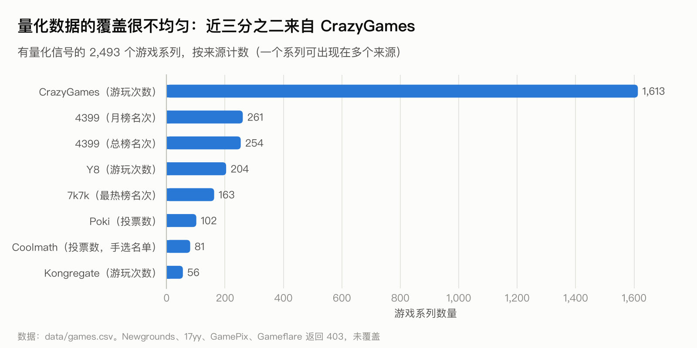

你要求的"至少 100 款真实游戏"达到了（有量化信号的 2,493 款），但 2005–2015 年 Flash 时代的历史热度主要靠 4399 总榜、Y8 和 Kongregate 三个来源，Newgrounds 和 Armor Games 的全量历史数据缺失。

---

## 4. Roblox 竞争调查（交付 C）

- 榜单快照：26 个官方榜单，1,784 行，1,003 款不同的游戏。
- 竞品检索：232 个检索词，18,558 条结果，7,295 款不同的游戏。
- 每个原型的完整竞品表在 `data/roblox_competitors.csv`，汇总指标在 `data/archetype_competition.csv`。

与结论相关的几个原型：

| 原型 | 直接竞品 CCU | CCU ≥ 1,000 的款数 | 近 12 个月访问 ≥ 500 万的新品 | 坟场 | 头部好评率 | 证据桶 |
|---|---|---|---|---|---|---|
| 发射／冲距离 + 升级 | 51,426 | 4 | 9 | 15 | 0.96 | proven_open |
| 布娃娃摔伤闯关 | 47,358 | 4 | 4 | 22 | 0.81 | proven_open |
| 物理破坏 | 29,269 | 5 | 6 | 34 | 0.92 | proven_open |
| 无尽跑酷／下坡 | 11,179 | 4 | 5 | 12 | 0.84 | proven_open |
| 点球／任意球 | 4,963 | 1 | 2 | 2 | 0.92 | live_open |
| 节奏自动跑酷（Geometry Dash 类） | 4,737 | 2 | 0 | 3 | 0.66 | live_entrenched |
| 摆钩／抓取 | 2,294 | 0 | 2 | 5 | 0.86 | live_open |
| 大头体育 | 973 | 0 | 1 | 3 | 0.92 | live_open |
| 圈地（paper.io） | 981 | 0 | 1 | 3 | 0.67 | live_open |
| 随机物理双人对战（Basket Random） | 39 | 0 | 0 | 0 | 0.76 | untested |
| 单指反应（Flappy、Helix、Crossy） | 175 | 0 | 1 | 4 | 0.82 | tried_and_died |
| 切水果 | 441 | 0 | 0 | 3 | 0.86 | tried_and_died |
| 合成掉落（Suika、2048） | 334 | 0 | 2 | 7 | 0.89 | tried_and_died |

"坟场"指拿过 100 万访问、现在不到 20 人在线的款数。

---

## 5. 量化模型（交付 D、E）

目标函数就是你给的那个，风险项取"期望亏损"：

**V = E[收入 − 成本] − λ × E[亏损]**，λ = 1，即亏一块钱的痛感是赚一块钱的两倍。

五个环节，每个都故意保持简单：

1. **起量概率**：先验赔率 × 一串似然比。先验是"一个有能力、范围收得住的个人开发者，随便一款游戏起量的概率"，取中位数 3%（90% 区间约 0.8%–10%）。似然比对应网页需求高低、品牌依赖、动量、Roblox 证据桶、拥挤度、头部质量、适配缺陷。**一个原型落进哪个桶由实测数据决定；每个桶乘多少是我给的区间。**
2. **起量后的规模**：帕累托长尾，指数 0.9–1.2，来自 Roblox 的 CCU 分布（每高一个数量级，游戏数量剩 8%–11%）。单个开发者的首年平均 CCU 封顶 2 万，避免均值被中彩票的结果支配。
3. **收入**：CCU × 8,760 小时 × $0.0125 × 小游戏折扣 × 类型指数。
4. **成本**：工时 × 超支 × 时间单价 + 试投现金。
5. **分阶段策略**：做到 35% 时过关口 A（好不好玩），做完 MVP 并试投后过关口 B（留存数据）。两道关口都是有误判率的测试。

两层蒙特卡洛：外层 600 个"世界"抽参数（所有原型共用同一组，保证排名在同一世界内比较），内层每个世界 3,000 次抽结果。

主要参数（完整清单和来源见 `data/model_params.json`）：

| 参数 | 取值 | 性质 |
|---|---|---|
| 平台每游玩小时分成 | $0.0125 | 由财报推算 |
| 小游戏折扣 | 中位数 0.4，对数标准差 0.7 | 假设 |
| 起量先验 | 中位数 3% | 假设 |
| 帕累托指数 | 0.9–1.2 | 由 CCU 分布推算 |
| 单人开发者 CCU 封顶 | 20,000 | 假设 |
| 时间单价 | $20/小时 | 假设，请改成你自己的 |
| 试投现金 | $100 / $250 / $500 三点 | 假设 |
| 关口 B 的准确度 | 灵敏度 85%，特异度 80% | 假设，未测量 |
| 类型指数范围 | 0.6–1.4 | 由"最赚钱"榜推算的代理变量 |

---

## 6. 不确定性与局限（交付 F）

按对结论的影响从大到小排列：

1. **起量先验和每小时收入是假设，而且决定了绝对值。** 先验从 3% 降到 1%，首选方向的每小时净值从 $28 掉到 $8；小游戏折扣取 0.15，掉到 $6。这两个参数公开数据定不下来。排名对它们不敏感，"值不值得做"对它们极度敏感。这正是为什么结论是"先买数据"。
2. **工时是我的估计。** 成本乘 1.5，首选方向的每小时净值掉到 $17。
3. **类型指数是弱代理。** 它假设收入与"最赚钱"榜名次成反比，再除以 CCU。基准情景下的第 1、2 名靠的就是它（见第 8 节）。
4. **Roblox 数据是单一时点。** 快照在周四 15:00 UTC，相当于美国上午上学时间，CCU 偏低且随时段波动。搜索每词最多 80 条，长尾里的失败者看不到，所以"新品成功数"有幸存者偏差：我找到的 877 款不满一年的直接竞品里 399 款访问超过 500 万，这是上限，不是成功率。
5. **我读了简介，没有试玩。** 竞品的"核心循环是否相同"靠标题和简介判断，可能有误判。
6. **没有任何留存数据。** 访问量换算成游玩小时时假设每次访问约 10 分钟。
7. **分类靠规则加人工修正。** 只人工核对了需求指数最高的 260 个系列。
8. **网页覆盖不全。** 见第 3 节。YouTube 和搜索趋势完全没测。
9. **时效。** Roblox 的流行格式以周为单位轮换，这份排名几周后就会过时。重跑脚本比相信这份报告更可靠。

10. **没有分玩法的玩家年龄数据。** 公开数据只有全平台的年龄结构和每款游戏的内容分级。第 12 节里细分年龄段的份额是推算，哪个玩法吸引哪个年龄段无从得知。

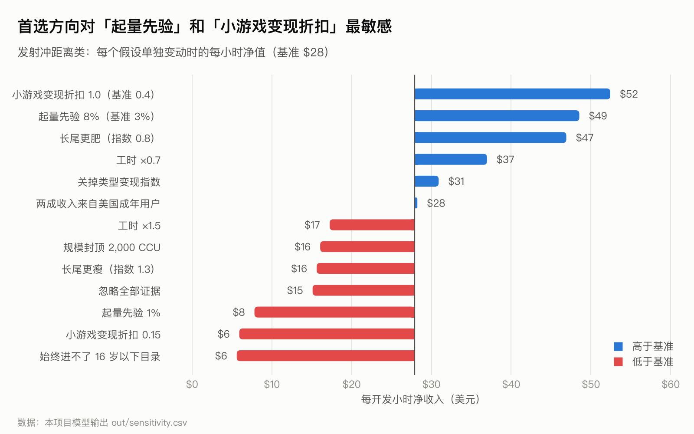

版权方面（不构成法律意见）：游戏规则和玩法不受著作权保护，但具体表达受保护。Tetris 诉 Xio 一案中，照搬方块造型、场地尺寸和视觉呈现被认定侵权。因此不要使用原作的名称、角色、关卡、美术和整体观感。Roblox 接受 DMCA 下架。数据里几款直接用了"Geometry Dash""Subway Surfers"字样的游戏，都承担着这个风险。

---

## 7. 前 10 名机会（交付 G）

| # | 玩法原型 | Roblox 证据 | 起量概率 [5%–95%] | 到数据关口的期望工时 | 每小时净值 均值 [5% / 50% / 95%] | 关掉类型指数后 | V（分阶段） | 排第 1 的概率 |
|---|---|---|---|---|---|---|---|---|
| 1 | 无尽跑酷／下坡（Subway Surfers、Slope） | proven_open，较拥挤 | 8.4% [1.8–21.0] | 73 h | $37 [2 / 22 / 117] | $25 | +$356 | 31% |
| 2 | 点球／任意球 | live_open，头部强 | 5.9% [1.2–15.1] | 62 h | $33 [1 / 18 / 108] | $23 | −$182 | 19% |
| 3 | **发射／冲距离 + 升级** | proven_open，头部强 | 7.4% [1.6–18.3] | 47 h | $28 [0 / 14 / 93] | **$31** | −$435 | 10% |
| 4 | 摆钩／抓取（黄金矿工） | live_open，不拥挤 | 6.2% [1.4–15.1] | 47 h | $26 [0 / 13 / 81] | $30 | −$622 | 8% |
| 5 | 大头体育对战 | live_open，头部强 | 4.2% [0.8–10.8] | 72 h | $21 [0 / 12 / 75] | $15 | −$1,513 | 3% |
| 6 | 球拍对打（羽毛球、乒乓） | live_open，头部强 | 4.1% [0.8–10.7] | 72 h | $21 [0 / 11 / 81] | $14 | −$1,528 | 4% |
| 7 | 物理破坏 | proven_open，头部强 | 6.1% [1.2–15.8] | 62 h | $20 [0 / 11 / 70] | $24 | −$1,431 | 4% |
| 8 | 布娃娃摔伤闯关 | proven_open，头部弱 | 6.7% [1.5–17.1] | 73 h | $18 [0 / 11 / 62] | $23 | −$1,758 | 3% |
| 9 | 荡绳／抓钩 | proven_open，较拥挤 | 5.6% [1.1–13.9] | 62 h | $17 [−1 / 9 / 56] | 未算 | −$1,674 | 2% |
| 10 | 吞噬成长（agar、hole.io） | proven_open，较拥挤 | 5.9% [1.1–14.9] | 72 h | $16 [0 / 9 / 58] | 未算 | −$2,004 | 1% |

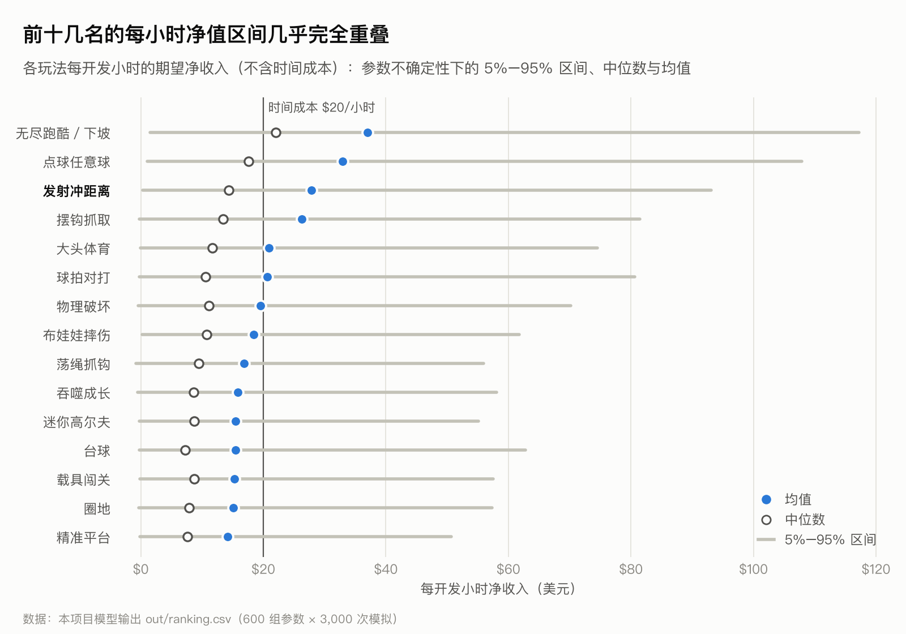

怎么读这张表：

- "到数据关口的期望工时"已经计入约四成项目在第一道关口就被砍掉；真走完 MVP 要多出约四成。

- **前四名打平。** 排第 1 的概率最高的也只有 31%。每小时净值的 5%–95% 区间互相完全重叠。
- **V 几乎全是负的。** 按 $20/小时和 λ = 1，只有第 1 名略高于零，而它的领先来自类型指数（下一节）。
- **基准情景和"关掉类型指数"两列的排名不一样**，这就是模型分辨率的极限。

被筛掉但数据里热度很高的：棋牌消除（受众不符，作为对照组保留）、塔防、网页 FPS、格斗、赛车（MVP 超过 160 小时）、你画我猜（聊天加自由绘画的审核风险）。全部 47 个原型的结果在 `out/ranking.csv`。

---

## 8. 前三名的反方分析（交付 H）

### 第 1 名：无尽跑酷／下坡

支持：网页需求在所有合格原型里最大（Subway Surfers 在 Poki 有 2,144 万投票，Slope 在 Y8 有 1.55 亿次游玩）。Roblox 上近 12 个月有 5 款新品访问超过 500 万。

反对：

- **证据桶是拼出来的。** 匹配到的前五名里，SKI 是硬核滑雪竞速，Run Or Die 是一对多生存，Hyper Speed Runner 是"+1 速度"增量游戏。真正的三车道跑酷克隆我找到六款，访问 190 万到 7,590 万，当前 CCU 最高 607，其余都不到 120。这是"拿到流量、留不住人"。
- **第 1 名来自类型指数。** SKI 被 Roblox 标为"竞速"，于是整个原型继承了"体育与竞速"的指数 1.39。这个指数是被靠抽卡变现的动漫体育游戏拉高的，跑酷套不上。关掉后它掉到第 3。
- **品牌依赖 0.57。** 网页需求大半是 Subway Surfers 这个品牌。Roblox 上那款克隆直接用了原作角色名。
- 跑酷平台类在 472 款最赚钱的游戏里只有 4 款。

结论：这个桶里真正活着的是"下坡滑行 + 升级"，和首选方向是同一个循环。它不构成一个独立的更优选项。

### 第 2 名：点球／任意球

支持：证据干净。That Freekick Challenge 十周 3,260 万访问，当前 3,659 CCU，好评率 0.95。Penalty Kicks! 五个月 3,910 万访问。2022 到 2025 年的几款老游戏也各自拿过 4,000 万到 4 亿访问。一对一对局，无法被第三人破坏。

反对：

- **时机已过。** 2026 年世界杯在 6 月 11 日至 7 月 19 日。两款热门分别创建于 5 月 22 日和 7 月 31 日；我找到的 11 款不满一年的新品里，9 款创建于 6 到 8 月，其中 7 款现在不到 30 人在线。下一个同量级的足球赛事在两年后。
- **衰减模式明显。** Super Free Kick 4,110 万访问，现在 5 人；Freekick Simulator 7,240 万，143 人；WPK 8,450 万，203 人。
- 头部很强，五天前刚更新。
- 对局需要对手，低 CCU 时必须做机器人；排位需要防作弊。
- 排名同样依赖 1.39 的类型指数，关掉后掉到第 6。

结论：需求是真的，但这是一个你已经错过发车时间的品类。

### 第 3 名：发射／冲距离 + 升级（最终选择）

支持：

- Roblox 证据最强也最干净：+1 Stone Skipping 上线 33 天，33,590 CCU；Kick a Lucky Block 六个月 19 亿访问；近 12 个月 9 款新品访问过 500 万。
- 相邻的两个口袋是同一个循环：下坡滑行（Survive The Slope! 5,754 CCU，好评率只有 0.78；SKI 4,707 CCU）和摔断骨头（Broken Bones IV，2018 年的游戏，至今 3,950 CCU，累计 15 亿访问）。
- 到数据关口的期望工时 47 小时，并列最低。单人可玩，没有对战同步，无法被捣乱。
- 变现模板现成。

反对：

- **这是 Roblox 上最商品化的格式。** 12 个月内我找到 41 款新品。头部好评率 0.96，三天内更新过。克隆以周为单位出现：Egg Skipping 创建于 10 月 1 日，距 +1 Stone Skipping 上线 26 天，好评率 0.39。
- **爆款可能靠的是包装而不是玩法。** Kick a Lucky Block 把踢远、海啸逃生、脑腐角色收集和大亨地块缝在一起。发行方背后有没有买量和导流，公开数据看不到。
- **坟场 15 款。** Goal Kick Simulator 4 亿访问，现在 224 人。三款直接叫"Learn to Fly"的克隆都没起来（最高的一款上线一年，52 人在线、86 万访问；另两款刚上线三周）：照搬原名看不出有用。
- **网页证据其实偏弱且偏旧。** Learn to Fly 在 Coolmath 有 76 万投票，Dolphin Olympics 2 在 Kongregate 有 1,310 万次游玩，Burrito Bison 500 万；动量只有 0.26，是 Flash 时代的需求。
- 增量模拟器靠每周更新维持，我估的每月 15 小时维护可能偏低。
- 关口 B 之前，你对留存一无所知。

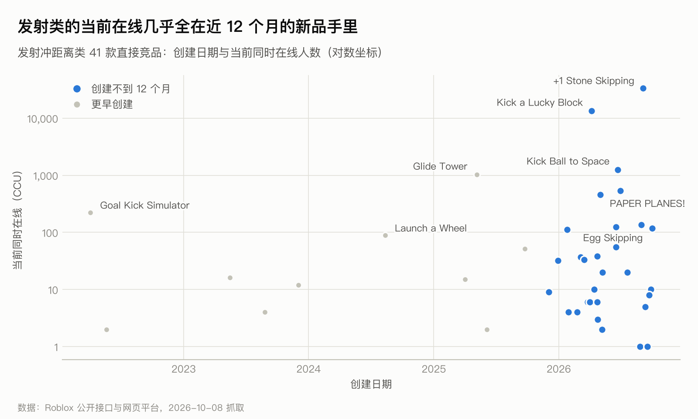

为什么仍然选它：反对意见里没有一条是它独有的（拥挤、克隆快、生命周期短，对前十名全部成立），而它的测试成本最低、证据最不需要解释。在一个模型分不出高下的并列里，选最便宜的那张票。

---

## 9. 唯一最佳候选与最低成本验证方案（交付 I、J）

### 做什么

一局十几秒的循环：发射，飞行中玩家有一个输入，落地按距离结算，买升级，再来。

**"套利"具体借什么：** 从简介看，Roblox 上现有的同类大多是"扔出去、看着飞、+1"。Flash 时代这一脉的设计深度在飞行过程里：Burrito Bison 的下砸弹跳时机、Learn to Fly 的滑翔控制和燃料管理。把"飞行中有一个需要技巧的输入"带进这个已被证实的需求口袋，是差异点。这一判断基于简介而非试玩，**开工前请先花一小时亲自玩前五名竞品核实。**

题材不要现在定。发射、下坡、摔落三个口袋都活着，题材留到关口 A 之后。

### 阶段与预算

| 阶段 | 内容 | 工时 | 现金 | 止损点 |
|---|---|---|---|---|
| 0 试玩 | 试玩 +1 Stone Skipping、Kick a Lucky Block、Survive The Slope!、Broken Bones IV、Hit a Golf Ball，记录各自飞行中有没有输入 | 1–2 | $0 | 如果它们已经有成熟的飞行操控，差异点不存在，换第二顺位 |
| 0 账号 | 创作者账号做年龄验证（成年人用证件）并开两步验证；缴 1,000 Robux 的可退发布费，或持有满两个月的 Plus／Premium 订阅。没有这些，游戏永远进不了 16 岁以下用户的目录 | 1 | 约 $13，可退 | — |
| A 灰盒原型 | 发射、飞行物理、一个飞行输入、落地计距、金币、一条升级线。电脑和手机都能操作。没有美术。角色用 R15 | 约 23 | $0 | 关口 A |
| B 可发布 MVP | 三条升级线、三个按距离解锁的区域、重生、存档、排行榜、两个通行证（双倍金币、自动发射）、一个开发者商品、埋点。内容分级问卷按 Minimal 或 Mild 填 | 约 42 | $0 | — |
| B 试投 | Roblox 赞助广告分 3–5 天投放，目标至少 1,000 名新用户。**这个阶段游戏只对已验龄的 16 岁以上用户可见**，试投同时用来凑满 250 次高活跃用户游玩 | 2 | $150–250 | 关口 B |
| B2 解锁后复测 | 进入 Kids 与 Select 目录后，用自然流量对全年龄用户再测一次留存 | 2 | $0 | 关口 B2 |
| C 上线版 | 更多区域、宠物或收集、每日奖励、每周更新 | 约 60 | 可选 | 每月复盘 |

工时是模型里的均值（最可能值 45 小时乘以超支）。1,000 名新用户时，20% 的次日留存测量误差约为正负 2.5 个百分点，足以做决定。

**年龄门槛对这个方案的三点影响**（规则和数据见第 12 节）：

- 关口 B 测到的是 16 岁以上用户的反应，不是你的目标用户。所以加了关口 B2：解锁之后用全年龄的自然流量再测一次。
- "高活跃用户"要求账号有一定年头、在你的游戏里有游玩时长、近 60 天在 Roblox 任意地方消费过。买来的访问里只有一部分算数，250 次可能需要一两千次访问才能凑满。这个比例没有公开数据，试投的第一天就能在后台的 Audience Reach 面板看到。
- 关口 A 找孩子试玩变麻烦了：未满 16 岁的试玩者必须是你这个已验龄账号的"信任好友"，并把游戏受众设为"仅试玩者"。找 16 岁以上的朋友试玩没有这个限制。

### 这个实验买到了什么

分阶段相对一次性做完，风险调整价值从 −$3,124 升到 −$435，差 **$2,689**。来源是：大多数注定失败的项目在第 23 或第 65 小时就被砍掉，而不是做满 160 小时。

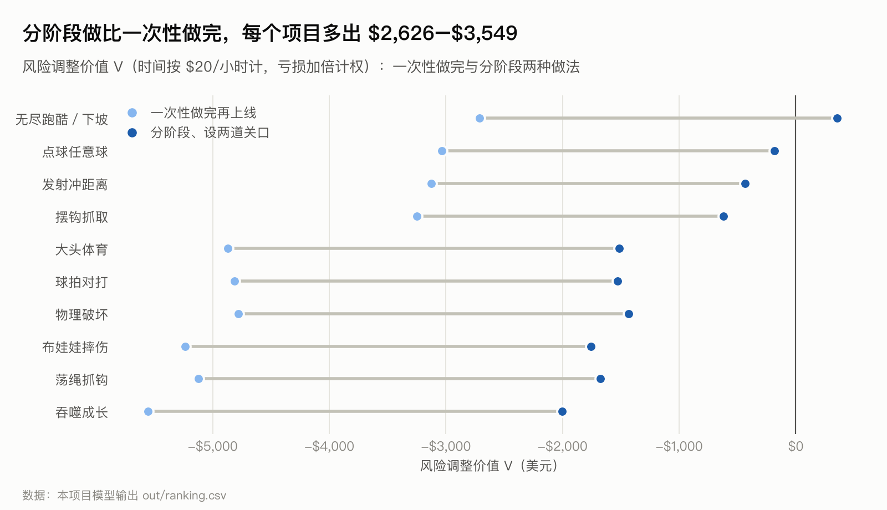

### 如果关口 B 没过

同一套框架（货币、升级、重生、存档、通行证）可以直接复用到第 4 名（摆钩抓取）、第 7 名（物理破坏）和第 8 名（布娃娃摔落）。第二个项目的工时应明显低于第一个，模型没有计入这部分节省。

把几个便宜的赌注按模型排名顺序连起来做（时间按 $20/小时计）：

| 工时预算 | 候选数 | 实际启动 | 至少 1 个起量 | 收入均值 | 收入中位数 | 利润 > 0 |
|---|---|---|---|---|---|---|
| 200 小时 | 3 | 2.5 个 | 14.8% | $8,756 | $0 | 10.8% |
| 400 小时 | 6 | 5.0 个 | 23.8% | $14,022 | $62 | 15.2% |
| 800 小时 | 6 | 5.9 个 | 24.8% | $16,358 | $73 | 13.7% |

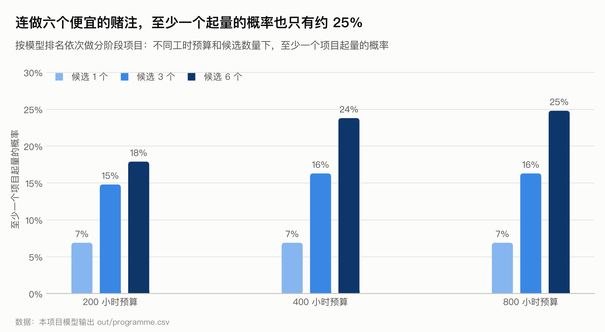

即使连做六个，四分之三的情况下一个都起不来。

---

## 10. Go / No-Go 标准（交付 K）

### 开工前

| 条件 | 判定 |
|---|---|
| 你一小时的真实机会成本低于约 $16 | Go |
| 在 $16–28 之间 | 只有当你能平静接受"白干 25 到 65 小时"时才 Go |
| 高于约 $28 | No-Go。期望值为负 |
| 你需要这个项目在 6 个月内产生可靠收入 | No-Go。利润为正的概率约 4% |
| 阶段 0 发现竞品已有成熟的飞行操控 | 换第二顺位（物理破坏或摆钩抓取） |

$16 和 $28 分别是 λ = 1（亏损加倍计）和 λ = 0（风险中性）时让首选方向的价值归零的时间单价。

### 关口 A（约 23 小时后，零现金）

找 5–10 个测试者，不给任何说明、任务或奖励。未满 16 岁的试玩者需要是你账号的信任好友（见第 9 节）。

| 观察项 | 过关 | 砍掉 |
|---|---|---|
| 15 秒内完成第一次发射 | 八成以上 | 不到一半 |
| 自愿连续发射 10 次以上 | 六成以上 | 不到一半的人做满 5 次 |
| 飞行输入被主动使用 | 多数人在第 3 次前用上 | 多数人全程没用 |

这些门槛是我定的设计目标，不是统计规律。

### 关口 B（约 65 小时加试投后）

这一关的数据全部来自已验龄的 16 岁以上用户。首要标准用 Roblox 后台自带的同类基准（日活过 100 后显示）。下面的绝对数字是备用线，来自彼此不一致的第三方文章，置信度低。

| 指标 | Go | 改一轮（最多 15 小时）再测 | 砍掉 |
|---|---|---|---|
| 后台同类基准百分位（留存与时长） | 高于中位 | 第 25–50 百分位 | 低于第 25 百分位 |
| 新用户次日留存 | ≥ 20% | 12%–20% | < 12% |
| 平均会话时长 | ≥ 10 分钟 | 6–10 分钟 | < 6 分钟 |
| 新用户完成 5 局以上的比例 | ≥ 60% | 40%–60% | < 40% |
| 好评率（至少 200 票） | ≥ 85% | 70%–85% | < 70% |
| 停投 7 天后自然流量占比 | ≥ 30% 且日活不跌 | — | 接近归零 |
| 高活跃用户游玩次数（60 天内要满 250 次） | 试投期内达到 | 过半，且自然流量还在涨 | 试投结束时不到 100 次 |

好评率的参照：头部竞品 0.94–0.96，Survive The Slope! 0.78，Egg Skipping 0.39。

付费转化在这个阶段只记录、不设门槛：一千个买来的用户不足以判断变现。

### 关口 B2（解锁 16 岁以下目录后两周）

用全年龄的自然流量重看关口 B 的同一组指标。过了才进入上线版。两种失败方式要分开处理：

| 情况 | 判定 |
|---|---|
| 16 岁以上数据好，解锁后全年龄数据也好 | Go，做上线版 |
| 16 岁以上数据好，解锁后明显变差 | 游戏对小孩不成立。改一轮操作难度和引导，再测；仍差则砍 |
| 60 天内解锁不了 | 砍掉。不要为它付 50,000 Robux 的加急审核费：模型里卡在这一步的每小时净值只有约 $6 |

### 整个方向的止损

连续失败几乎不提供关于"这个方向对不对"的信息（单个成功率只有 7% 左右时，连败三次本来就是常态）。所以止损规则是预算规则，不是推断规则：**事先定一个总额，例如 400 小时加 $1,000，花完就停。**

---

## 11. 结构化数据（交付 L）

| 文件 | 内容 |
|---|---|
| `data/games.csv` | 候选数据库，3,787 行，一行一个游戏系列 |
| `data/web_games_raw.csv` | 网页平台原始记录，5,598 行 |
| `data/archetypes.json` | 49 个玩法原型的全部定义和判断项 |
| `data/archetype_demand.csv` | 各原型的跨平台需求证据 |
| `data/roblox_charts.csv` | Roblox 官方榜单快照 |
| `data/roblox_competitors.csv` | 各原型的直接竞品，1,680 行 |
| `data/archetype_competition.csv` | 各原型的竞争指标 |
| `data/roblox_genre_stats.csv` | Roblox 类型结构和类型指数 |
| `data/roblox_creator_portfolios.csv` | 25 款头部竞品发行方的其他作品 |
| `data/scratch_signal.csv` | Scratch 信号 |
| `data/roblox_maturity.csv` | 7,814 款 Roblox 游戏的内容分级标签 |
| `data/age_reference.json` | 年龄相关的事实与假设，逐条标注来源 |
| `data/age_segments.csv`、`data/age_reach_by_label.csv` | 各年龄段的份额、账号类型、可触达范围、相对价值 |
| `data/maturity_market.csv`、`data/maturity_by_archetype.csv` | 榜单和各玩法竞品的内容分级构成 |
| `data/scratch_age_distribution.csv` | Scratch 用户注册年龄分布 |
| `data/model_params.json` | 全部模型参数、性质和来源 |
| `out/ranking.csv` | 47 个原型的模型输出 |
| `out/sensitivity.csv`、`out/programme.csv`、`out/outcomes.csv` | 敏感性分析、多项目视角、各结局的概率 |
| `out/charts/*.png` | 19 张图，由 `scripts/08_charts.py` 生成 |
| `out/report_tables.md` | 本报告所有表格的完整版 |

更新方法见 `README.md`。最值得你先改的三个参数：时间单价、各原型的 `mvp_h`、起量先验。

---

## 12. 年龄段分析

### 12.1 公开数据能回答什么、不能回答什么

| 问题 | 能否回答 | 依据 |
|---|---|---|
| Roblox 用户的年龄结构 | 能，部分是推算 | Roblox 公布了已验龄用户的构成和验龄渗透率 |
| 新游戏能触达哪些年龄段 | 能 | Roblox 创作者文档里的账号类型与发布规则 |
| 不同年龄段对开发者值多少钱 | 只有成年与未成年的对比，且仅限美国 | Roblox 股东信和 DevEx 公告 |
| 每款游戏允许哪些年龄进入 | 能 | 我抓了 7,814 款游戏的内容分级标签 |
| **某个玩法实际吸引哪个年龄段** | **不能** | 每款游戏的玩家年龄只有它的所有者能在后台看到 |
| 分年龄段的留存 | 不能 | 没有任何公开来源 |
| 网页小游戏平台的受众年龄 | 不能，只有 Scratch | 各平台不公布 |

所以本节不给"某玩法适合几岁"的结论。那需要你自己的游戏上线后在后台看。

### 12.2 Roblox 的年龄结构

Roblox 在 2026 年第二季度股东信里公布的事实：

- 57% 的日活已完成年龄验证。
- 已验龄用户中，35% 未满 13 岁，38% 在 13–17 岁，27% 满 18 岁。
- 未成年用户的验龄渗透率：全球 60%，美国 75%。
- 美国成年用户的日活同比增长 32%、时长增长 27%；其中 18–34 岁增长 42% 和 37%。

由前三条可以反推全体日活的结构：未满 18 岁约占 **69%**，成年人约占 **31%**，成年人的验龄渗透率约 50%。再往下细分需要两个假设（13–17 岁里 16–17 岁占四成；未满 13 岁里 5–8 岁占一半），所以下表的细分数字是推算，不是 Roblox 的数字。

| 年龄段 | 占日活（推算） | 其中已验龄 | 账号类型 | 聊天 |
|---|---|---|---|---|
| 5–8 岁 | 17% | 10% | Roblox Kids | 默认关闭 |
| 9–12 岁 | 17% | 10% | Roblox Select | 未验龄时关闭 |
| 13–15 岁 | 22% | 13% | Roblox Select | 未验龄时关闭 |
| 16–17 岁 | 14% | 9% | 已验龄为 Roblox，否则为 Select | 已验龄则默认开启 |
| 18 岁以上 | 31% | 15% | 已验龄为 Roblox，否则为 Select | 已验龄则默认开启 |

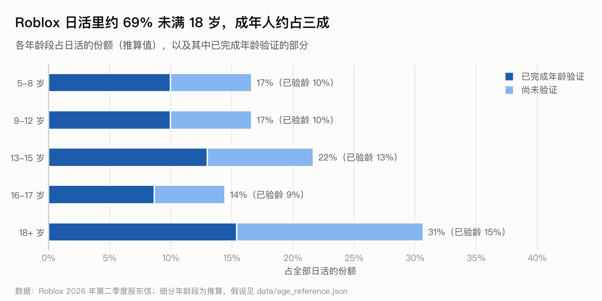

### 12.3 年龄门槛：新游戏先只对 16 岁以上开放

这是本节最重要的发现，也是第一版报告漏掉的。规则来自 Roblox 创作者文档（2026 年 6 月随 Kids 与 Select 账号上线）：

| 想触达 | 创作者要满足 | 游戏要满足 |
|---|---|---|
| 16 岁以上 | 账号状态正常且注册满 2 天；完成年龄验证；填写内容分级问卷 | 无。免费 |
| 16 岁以下（Kids 与 Select 账号） | 另需：成年人用证件验证；开两步验证；缴 1,000 Robux 可退发布费，或持有满两个月的 Plus／Premium 订阅 | **试用期只对已验龄的 16 岁以上用户开放**；60 天窗口内拿到 250 次"高活跃用户"的独立游玩后，才进入 Kids 与 Select 的目录 |

- "高活跃用户"要同时满足三条：账号有一定年头；在你的游戏里有游玩时长；近 60 天在 Roblox 任意地方消费过。不需要在你的游戏里消费。
- 没验龄的用户不管实际多大，都按自报年龄归入 Kids 或 Select。所以没验龄的成年人在试用期同样看不到你的游戏。
- 想跳过等待，可以付 50,000 Robux 的加急审核费（可退，48 小时出结果）。按零售价约合 $625。
- Kids 与 Select 目录目前约有 3 万款游戏。

按上面的年龄结构推算，一款新游戏各阶段能触达的日活：

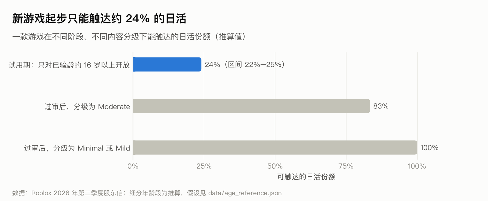

试用期能触达的约 24%（按假设不同在 22%–25% 之间）。按消费能力算稍高，约 28%，因为这部分人里成年人多。

这对你的含义很直接：**你想服务的儿童和青少年不是你的第一批用户。** 游戏必须先让一批 16 岁以上、近期付过费的老用户愿意玩，才有机会被孩子看到。

### 12.4 不同年龄段对开发者值多少钱

- Roblox 称美国成年用户的人均消费比未成年用户高 50% 以上。
- 2026 年 6 月 8 日起，美国已验龄成年用户的合格消费按每 Robux $0.0054 结算，比标准的 $0.0038 高 42%。条件：游戏使用 R15 角色；消费类型为通行证、订阅、部分游戏内物品、私人服务器。
- 两者相乘，一个美国成年用户给开发者带来的收入约为未成年用户的 **2.1 倍**。
- 反方向：Roblox 把第二季度流水不及预期归因于美国和加拿大低龄用户的每小时变现下降，没有给数字。

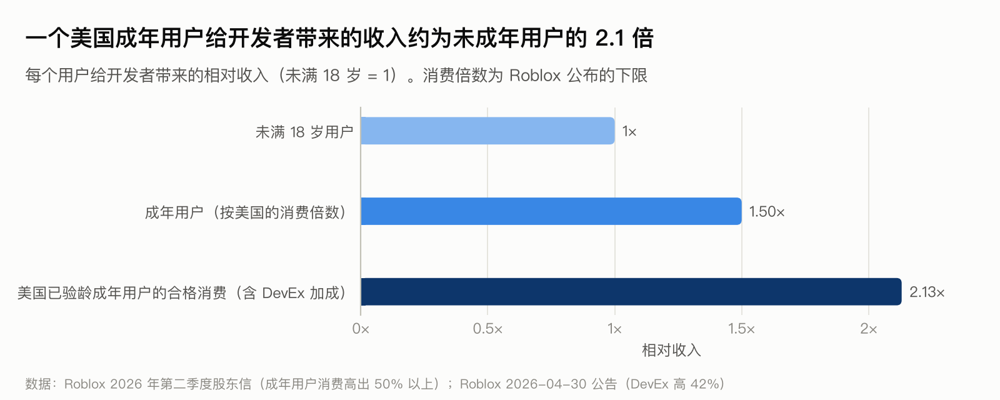

对首选方向的实际影响不大：假设两成收入来自美国成年用户的合格消费，每小时净值从 $27.9 升到 $28.2。**不值得为了这个加成去改玩法，但值得从一开始就用 R15，因为不花成本。**

### 12.5 内容分级不是瓶颈

每款游戏的内容分级决定哪类账号能进入：Minimal 和 Mild 对所有人开放，Moderate 不对 5–8 岁开放，Restricted 只对已验龄成年人开放。

我抓到分级标签的 7,814 款游戏里，Minimal 占 68%，Mild 占 28%，Moderate 占 4%，没有抓到 Restricted。按榜单在线人数算，约 94% 在 Minimal 或 Mild 的游戏里。

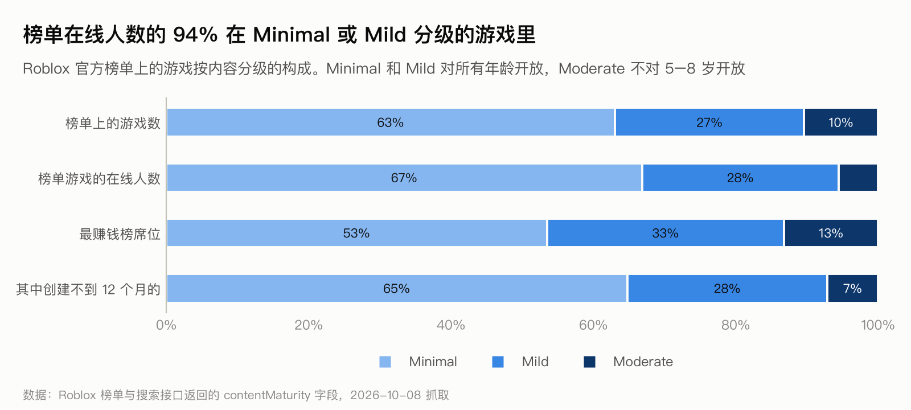

候选玩法的现有竞品也几乎全是 Minimal 或 Mild。发射类 99% 是 Minimal；布娃娃摔伤类 88% 是 Mild。也就是说，所有候选玩法在过审之后都能触达全部年龄段，分级不构成候选之间的差别。

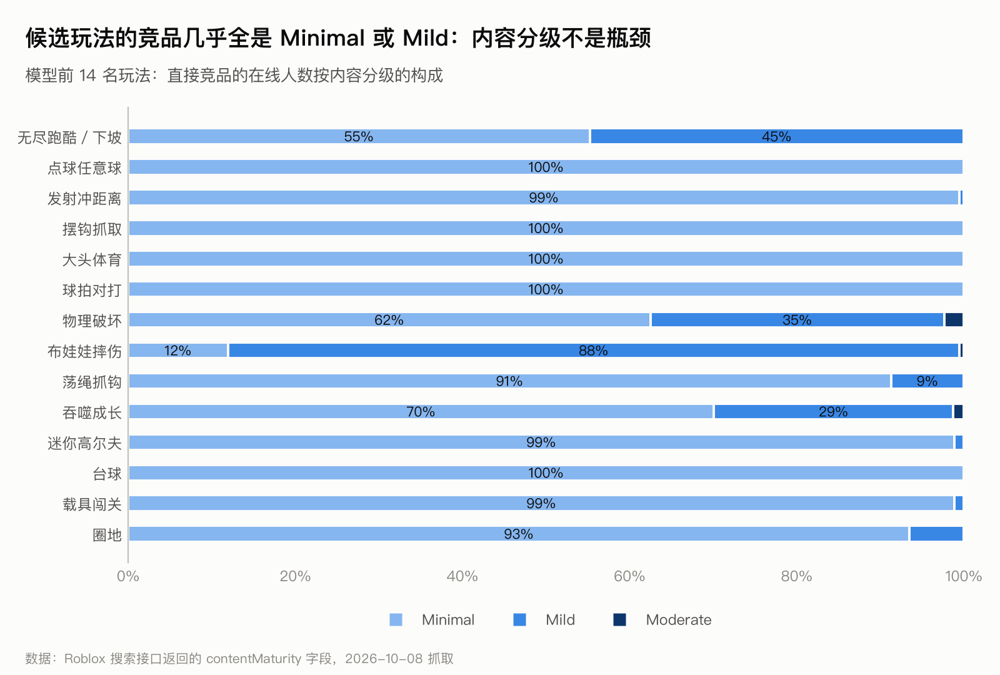

### 12.6 Scratch 信号代表谁

第 2 节用 Scratch 上儿童自制克隆的浏览量作为一个辅助需求信号。Scratch 公布了用户注册时自报的年龄：62% 在 9–15 岁，峰值 12 岁，18 岁以上占 25%（包含教师和家长）。所以这个信号反映的主要是 9–15 岁，和 Roblox 的 Select 账号年龄段重合。

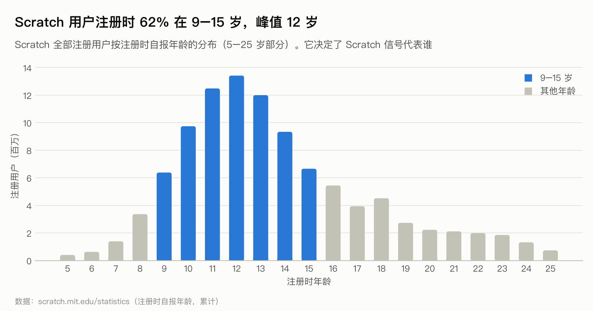

### 12.7 这对结论和方案改了什么

1. **最终选择不变。** 年龄门槛对所有候选一视同仁，内容分级也没有拉开差距。
2. **验证方案改了三处**（已写入第 9、10 节）：开工前加了账号准备；关口 B 明确是 16 岁以上用户的数据；新增关口 B2，解锁后对全年龄再测一次。
3. **首选方向的两个特点在新规则下更有利。** 它单人可玩、不依赖聊天，而 Kids 账号和未验龄的 Select 账号聊天默认是关的；它的玩法没有年龄偏向的内容，能填 Minimal。
4. **下行风险多了一种。** 如果游戏始终解锁不了 16 岁以下的目录，模型里首选方向的每小时净值从 $28 掉到约 $6，和最悲观的两个假设同一量级。
5. **模型基准没有单独为年龄门槛打折。** 起量先验是参照 2026 年的榜单流动性定的，其中 7–9 月的新品已经处在新规则下，再打一次折会重复计算。但这是判断，不是测量。

---

## 13. 图表索引

全部图片在 `out/charts/`，由 `scripts/08_charts.py` 从 CSV 生成。每张图的数值都能在对应的 CSV 里找到。

| 文件 | 回答的问题 | 所在章节 |
|---|---|---|
| `01_top_earning_by_genre.png` | 钱在哪些类型里，其中多少是新品 | 1.4 |
| `02_top_earning_age.png` | 最赚钱的游戏有多年轻 | 1.3 |
| `03_reach_vs_retention.png` | 拿到流量和留住人是不是一回事 | 1.2 |
| `04_web_vs_roblox_demand.png` | 网页热度能否预测 Roblox 热度 | 1.5 |
| `05_evidence_buckets.png` | 有多少玩法在 Roblox 上是真正的空白 | 2 |
| `06_ranking_intervals.png` | 候选之间分不分得出高下 | 7 |
| `07_staged_vs_commit.png` | 分阶段值多少钱 | 9 |
| `08_sensitivity_pick.png` | 结论对哪些假设最敏感 | 6 |
| `09_programme.png` | 连做几个，至少成一个的概率 | 9 |
| `10_outcomes_pick.png` | 做一次最可能落到哪种结局 | 0 |
| `11_web_alltime_vs_current.png` | 哪些网页玩法只是历史热门 | 2 |
| `12_data_coverage.png` | 量化数据来自哪些平台 | 3 |
| `13_launch_competitors.png` | 发射类的在线人数在谁手里 | 8 |
| `A1_age_mix.png` | Roblox 用户的年龄结构 | 12.2 |
| `A2_reach_by_stage.png` | 新游戏各阶段能触达多少日活 | 12.3 |
| `A3_value_per_user.png` | 成年用户比未成年用户多值多少 | 12.4 |
| `A4_maturity_market.png` | 市场按内容分级的构成 | 12.5 |
| `A5_maturity_by_archetype.png` | 候选玩法的分级有没有差别 | 12.5 |
| `A6_scratch_signup_age.png` | Scratch 信号代表哪个年龄段 | 12.6 |

---

## 14. 来源

Roblox 一手数据：
- Roblox 公开接口（榜单、搜索、游戏详情、发行组），2026-10-08 抓取，原始结果在 `data/`
- [Roblox 2026 年第二季度财报（SEC 8-K）](https://www.sec.gov/Archives/edgar/data/0001315098/000162828026051059/ex991-robloxq22026earnin.htm)：收入、游玩小时、日活、开发者分成、已验龄用户的年龄构成
- [Roblox 2025 财年 10-K](https://www.sec.gov/Archives/edgar/data/1315098/000131509826000024/rblx-20251231.htm)：1,400 万个活跃体验，23,500 名创作者通过 DevEx 提现
- [Roblox 创作者文档：变现方式与 DevEx 汇率](https://create.roblox.com/docs/production/earn-on-roblox)
- [Roblox 创作者文档：Creator Rewards](https://create.roblox.com/docs/creator-rewards)
- [Roblox 创作者文档：留存分析](https://create.roblox.com/docs/en-us/production/analytics/retention)（不提供基准数值）
- [Roblox 新闻稿：推荐算法改为 28 天窗口](https://about.roblox.com/newsroom/2026/06/optimizing-discovery-great-games-reach-millions-players-roblox)
- [Roblox Studio MCP 服务器文档](https://create.roblox.com/docs/studio/mcp)
- [Roblox 创作者文档：Roblox Kids 与 Select 的发布要求](https://create.roblox.com/docs/production/publishing/kids-and-select)（原文取自 Roblox/creator-docs 的 GitHub 主分支）
- [Roblox 创作者文档：发布费与加急审核费](https://create.roblox.com/docs/production/publishing/publish-games-and-places)
- [Roblox 新闻稿：按年龄划分的账号类型](https://about.roblox.com/newsroom/2026/04/introducing-roblox-kids-and-select-accounts)
- [Roblox 新闻稿：美国成年用户消费的 DevEx 汇率提高 42%](https://about.roblox.com/newsroom/2026/04/roblox-fuels-high-fidelity-games-over-18-players-increases-qualifying-devex-rate-42)
- [Scratch 统计页](https://scratch.mit.edu/statistics/)：用户注册年龄分布

第三方，置信度较低：
- [RoWatcher：Roblox 上有多少游戏](https://rowatcher.com/news/how-many-games-are-on-roblox-in-2026)：CCU 分布
- [RoWatcher：买量的盈亏平衡](https://rowatcher.com/news/roblox-ads-in-2026-the-break-even-math-small-devs-ignore)：每次访问 4–12 Robux
- [RoWatcher：分类型留存基准](https://rowatcher.com/news/retention-benchmarks-by-roblox-genre-what-good-actually-looks-like)：未注明数据来源

网页平台：CrazyGames、Poki、Y8、4399、7k7k、Coolmath Games、Kongregate、Scratch 等的公开页面，2026-10-08 抓取。

法律背景：
- [法院如何看待电子游戏的著作权保护（Frankfurt Kurnit）](https://fkks.com/news/how-courts-view-copyright-protection-for-video-games)
- [Tetris 诉 Xio 案评述（Cole Schotz）](https://coleschotz.com/tetris-defeats-the-clones-in-copyright-infringement-battle)
